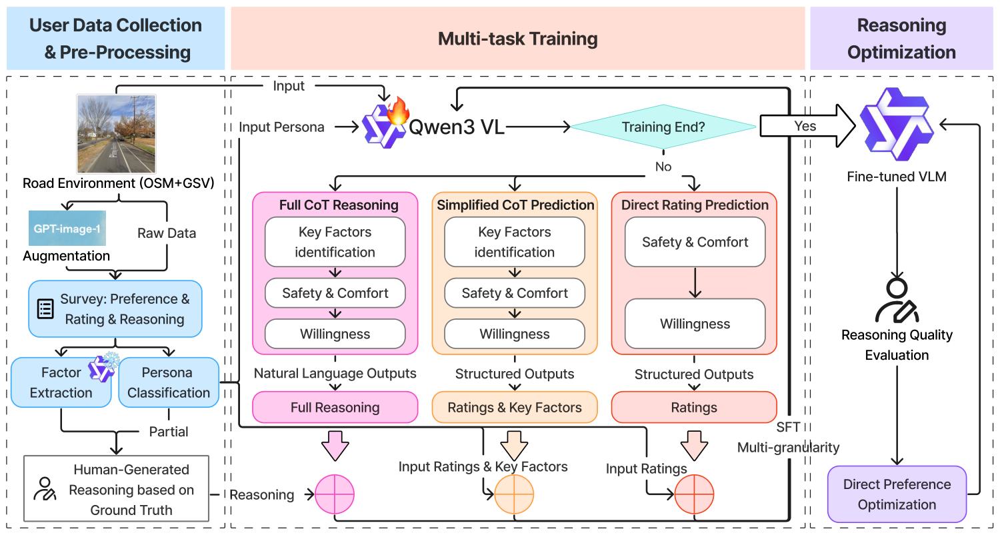
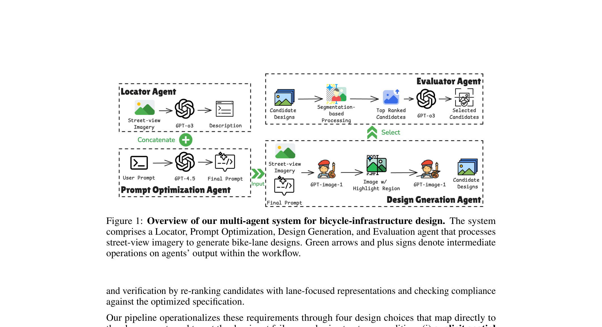
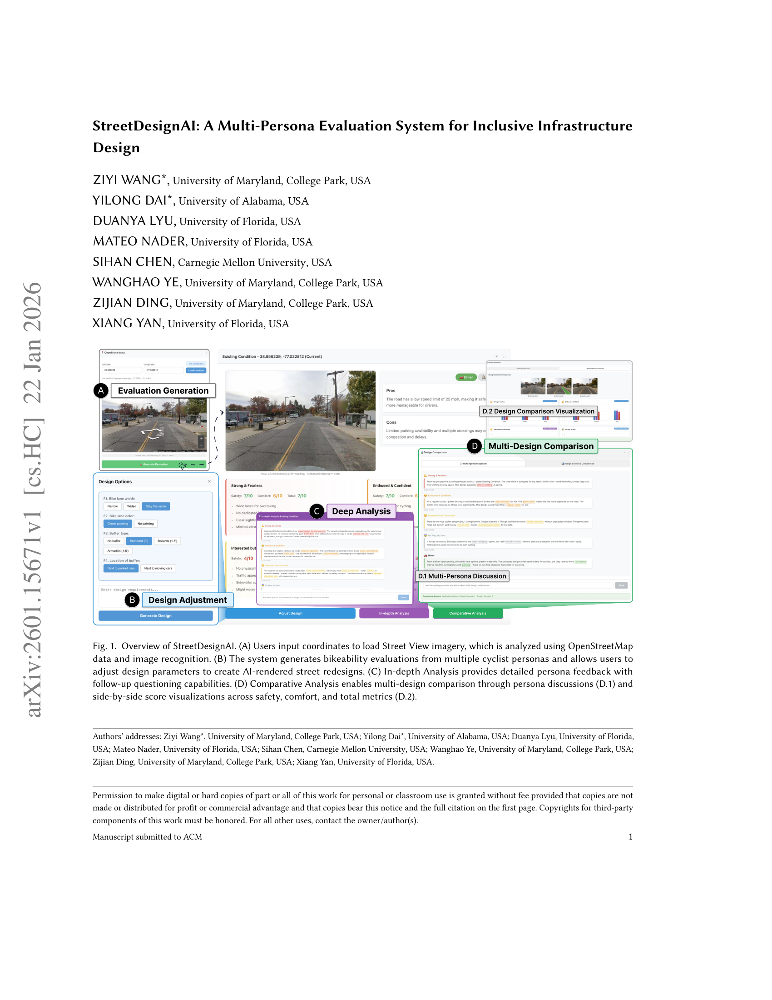

<p align="center">
<h1 align="center"><strong>From Bikeability Assessment to Inclusive Street Design:<br>A Vision-Language Framework</strong></h1>
</p>

<p align="center">
  <a href="https://arxiv.org/abs/2601.03534" target="_blank">
    
  </a>
  <a href="https://arxiv.org/abs/2509.05469" target="_blank">
    
  </a>
  <a href="https://arxiv.org/abs/2601.15671" target="_blank">
    
  </a>
  <a href="https://github.com/Dyloong1/Bikeability" target="_blank">
    
  </a>
</p>

This repository hosts three interconnected research projects on **human-centered cycling infrastructure assessment and design**. Together, they form a coherent pipeline: **(1)** a persona-aware Vision-Language Model (VLM) that produces cyclist-type-specific bikeability ratings with interpretable explanations, **(2)** a multi-agent image generation pipeline that renders realistic street redesign scenarios directly on real-world street-view imagery, and **(3)** an interactive multi-persona evaluation system that enables infrastructure designers to iteratively evaluate and refine street designs through structured feedback from diverse simulated cyclist personas.

---

## Table of Contents

- [BikeabilityAssessment: Persona-Aware VLM Backbone](#-bikeabilityassessment-persona-aware-vlm-backbone)
- [Image Generation: Multi-Agent Street Design Pipeline](#-image-generation-multi-agent-street-design-pipeline)
- [StreetDesignAI: Interactive Design Evaluation System](#-streetdesignai-interactive-design-evaluation-system)
- [Citation](#-citation)
- [Acknowledgments](#-acknowledgments)

---

## 🧠 BikeabilityAssessment: Persona-Aware VLM Backbone

**Yilong Dai<sup>1,\*</sup>, Ziyi Wang<sup>2,\*</sup>, Chenguang Wang<sup>3</sup>, Kexin Zhou<sup>1</sup>, Yiheng Qian<sup>1</sup>, Susu Xu<sup>4</sup>, Xiang Yan<sup>1</sup>**
<br><sup>1</sup>University of Florida &nbsp; <sup>2</sup>University of Maryland &nbsp; <sup>3</sup>Stony Brook University &nbsp; <sup>4</sup>Johns Hopkins University

<p align="center">
  
</p>

**BikeabilityAssessment** proposes a persona-aware framework that integrates Vision-Language Models with the "Four Types of Cyclists" typology (Strong & Fearless, Enthused & Confident, Interested but Concerned, No Way No How) to produce cyclist-type-specific bikeability assessments. Key contributions:

- **Theory-grounded persona conditioning** based on established cyclist typology, generating persona-specific explanations via chain-of-thought reasoning
- **Multi-granularity supervised fine-tuning** with dynamic task weighting that bridges the gap between abundant structured ratings and coherent reasoning narratives
- **AI-enabled counterfactual image augmentation** via generative image editing to isolate individual infrastructure variable impacts
- **Publicly released dataset** of 12,400 persona-conditioned assessments from 427 cyclists collected through an immersive 360° street-view survey in Washington DC

### Project Structure

```
BikeabilityAssessment/
├── code/
│   ├── train_qwen_vl.py              # Qwen VL model training
│   ├── qwen_vl_predict.py            # Qwen VL prediction
│   ├── qwen_feature_extraction.py    # Feature extraction using Qwen
│   ├── sft_data_preparation.py       # SFT data preparation
│   ├── ablation_training_script.py   # Ablation study training
│   ├── gpt4o_baseline.py             # GPT-4o baseline
│   ├── gpt4o_eval.py                 # GPT-4o evaluation
│   ├── gpt4o_eval_language.py        # GPT-4o language evaluation
│   ├── extract_gpt4o_factors.py      # Factor extraction from GPT-4o
│   └── rf_baseline_training.py       # Random Forest baseline
├── data/
│   ├── bike_lane_info.csv            # Bike lane infrastructure attributes
│   ├── indicator_pool.json           # Evaluation indicator pool
│   ├── locations_info.json           # Survey location metadata
│   ├── ratings_anonymous.json        # Anonymized cyclist ratings
│   └── surveys_anonymous.json        # Anonymized survey responses
```

---

## 🎨 Image Generation: Multi-Agent Street Design Pipeline

> 🎉 **Accepted at NeurIPS 2025 Workshop!**

**Chenguang Wang<sup>1,2</sup>, Xiang Yan<sup>3</sup>, Yilong Dai<sup>3</sup>, Ziyi Wang<sup>4</sup>, Susu Xu<sup>1</sup>**
<br><sup>1</sup>Johns Hopkins University &nbsp; <sup>2</sup>Stony Brook University &nbsp; <sup>3</sup>University of Florida &nbsp; <sup>4</sup>University of Maryland

<p align="center">
  
</p>

This work introduces a **multi-agent system** that edits and redesigns bicycle facilities directly on real-world street-view imagery. The framework integrates four specialized agents into a coherent pipeline:

- **Locator Agent** — generates contextually accurate descriptions of bike-lane positions using MLLMs for spatial grounding
- **Prompt Optimization Agent** — refines user prompts by integrating illustrative references with contextual descriptions, reducing semantic misinterpretation
- **Design Generation Agent** — decouples geometric and design-pattern constraints via cascading generation, yielding multiple candidate designs
- **Evaluator Agent** — re-ranks candidates via CLIP similarity and conducts binary compliance checks with reasoning MLLMs

Experiments across diverse urban scenarios demonstrate that the system can adapt to varying road geometries and environmental conditions, consistently yielding visually coherent and instruction-compliant results.

---

## 🛠️ StreetDesignAI: Interactive Design Evaluation System

> 🎉 **Accepted at DIS 2026!**

**Ziyi Wang<sup>1,\*</sup>, Yilong Dai<sup>2,\*</sup>, Duanya Lyu<sup>2</sup>, Mateo Nader<sup>2</sup>, Sihan Chen<sup>3</sup>, Wanghao Ye<sup>1</sup>, Zijian Ding<sup>1</sup>, Xiang Yan<sup>2</sup>**
<br><sup>1</sup>University of Maryland &nbsp; <sup>2</sup>University of Florida &nbsp; <sup>3</sup>Carnegie Mellon University

<p align="center">
  
</p>

**StreetDesignAI** is an interactive evaluation system for inclusive cycling infrastructure design. Building on the VLM backbone from BikeabilityAssessment and the image generation pipeline, it operationalizes persona-based multi-agent evaluation to make experiential conflicts explicit during the design process. The system enables designers to:

1. **Ground evaluation in real street context** through Street View imagery and OpenStreetMap data
2. **Receive parallel feedback** from simulated cyclist personas spanning confident to cautious users
3. **Iteratively modify designs** with AI-rendered street-level visualizations while the system surfaces conflicts across perspectives

A within-subjects study with 26 transportation professionals demonstrated that structured multi-perspective feedback significantly improves designers' understanding of diverse persona needs, confidence in translating those needs into inclusive design decisions, and overall satisfaction compared to general-purpose AI chatbots.

### Data Structure

```
StreetDesignAI/
├── Interaction Data/          # Per-participant interaction logs (26 participants)
│   ├── 01/ - 26/             # Each folder contains:
│   │   ├── existing-condition.*       # Original street view images
│   │   ├── design-scenario-*.png      # AI-rendered design modifications
│   │   ├── bike-lane-design-*.json    # Design parameter specifications
│   │   └── Screenshot*.png            # Session screenshots
├── Transcript/                # Interview transcripts (26 sessions)
│   ├── 01.txt - 26.txt
├── log data/                  # System interaction logs (JSON)
├── survey data/               # Survey responses
│   ├── ChatGPT Survey.xlsx
│   ├── Pre-study Survey.xlsx
│   └── StreetDesignAI Survey.xlsx
├── Study hot take-pilots.docx
└── Study hot takes-professionals.docx
```

---

## 📖 Citation

If you find this work useful, please cite our papers:

```bibtex
@article{dai2026persona,
  title={Persona-aware and Explainable Bikeability Assessment: A Vision-Language Model Approach},
  author={Dai, Yilong and Wang, Ziyi and Wang, Chenguang and Zhou, Kexin and Qian, Yiheng and Xu, Susu and Yan, Xiang},
  journal={arXiv preprint arXiv:2601.03534},
  year={2026}
}

@article{wang2025image,
  title={From image generation to infrastructure design: a multi-agent pipeline for street design generation},
  author={Wang, Chenguang and Yan, Xiang and Dai, Yilong and Wang, Ziyi and Xu, Susu},
  journal={arXiv preprint arXiv:2509.05469},
  year={2025}
}

@article{wang2026streetdesignai,
  title={StreetDesignAI: A Multi-Persona Evaluation System for Inclusive Infrastructure Design},
  author={Wang, Ziyi and Dai, Yilong and Lyu, Duanya and Nader, Mateo and Chen, Sihan and Ye, Wanghao and Ding, Zjian and Yan, Xiang},
  journal={arXiv preprint arXiv:2601.15671},
  year={2026}
}
```

---

## 🙏 Acknowledgments

This work is supported by the **University of Florida** and the **National Science Foundation (NSF)**.
